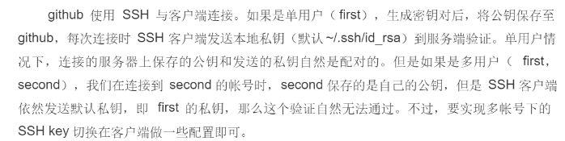
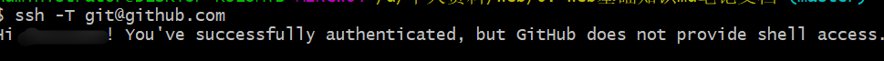

## ==多人协同-日常开发规范==

0\. 克隆项目所有分支（release实际开发，都没有权限，可以不不拉取，拉取的默认是远程master的代码）

```bash
# 注意是 https:// 的地址
git clone https://github.com/ifer-itcast/test.git（组长的地址）

# 可以是 git fetch 远端地址 远端分支:本地分支
# git fetch https://github.com/ifer-itcast/test.git release:release
git checkout release # 如果说本地有，就切换到本地的 release，如果没有就去远端拉取 release 并切换

# git fetch https://github.com/ifer-itcast/test.git develop:develop
git checkout develop
```

1\. 创建`任务分支`

```bash
# 切换到 develop 分支
git checkout develop # 如果本地有 develop 分支，就直接切换，如果本地没有，会去远端把 develop 拉过来并切换到 develop
# 例如创建基础题库分支，规范(feature/功能)
git checkout -b feature/questions
```

其他举例

```bash
feature/questions # 基础题库
feature/questions-choice # 精选题库
feature/questions-new # 试题录入
feature/randoms # 题组列表
feature/subjects # 学科管理
feature/directorys # 目录管理
feature/tags # 标签管理
feature/articles # 面试技巧
```

2\. 当你开发完成一个小功能/步骤需要提交代码

```bash
# 添加到暂存
git add .
# 提交本地仓库，无需推送！
git commit -m '备注'
```

3\. 开发完毕

当你确认你的任务功能开发完毕后，合并到develop分支然后推送到远程

```bash
# 切换到develop分支
git checkout develop
# 注意！！！！拉取最新develop分支（没有配置origin直接使用仓库地址）
git pull origin develop
# 合并自己的任务分支   例如（featrue/questions）基础题库
git merge feature/questions
# 推送develop分支 （没有配置origin直接使用仓库地址）
git push origin develop
```

`切换到了 develop，拉取了远端代码，合并了自己分支的代码，此时还需要再次开发新功能，建议直接基于 develop 重新创建一个新分支`（原来的功能分支没有远程dev最新的代码，新建的功能分支可以拉取远程dev的分支）

假如张三又想开发一个新功能

```bash
# 保证目前处于 develop
git checkout -b feature/questionAdd
# 写代码....
git add .
git commit -m 又开发完啦
# 自己的分支没有必要 push 到远端
git checkout develop
# 注意！！！！拉取最新 develop 分支的代码
git pull origin develop
# 再合并
git merge feature/questionAdd
```

<font color=e32d40>**注意：checkout 切换分支之前要保证当前分支是干净的！**</font>（需要提交后再切换）

## git常用习惯及技巧

1. 功能分支login一般先提交到远程仓库（远程仓库的login分支），再合并到本地master分支，再一起推送到远程master。这样做的目的是保留所有的开发环境，万一这个功能以后由别的人来维护。
2. 如果没有将本地分支合并到本地master并推送到远程master。则需要远程master的合并，远程master分支的合并一般在版本开发测试完成时，由公司的主管级别的人全部合并到远程master分支
3. 提交邮箱一定和自己在gitee上的邮箱一致，不然就是自己再给别人写代码
   

## git使用常见问题

换了一个本地git仓库之后，origin里面存储的变量不存在了，只存在上一个git库里，新换的origin需要重新存储远程仓库地址。记住一点，每个本地库之间是独立的，所有一切需要重新设置。

在本地test文件夹下git bash，然后clone远程仓库test-login（远程仓库名），结果是会在test下新建一个test-login文件夹，里面放有所有的项目文件，需要`cd test-login`进入，才能进行git管理，`test-login`才是被git管理的根目录文件夹。此时本地只有master分支的东西，需要自己新建本地dev分支进行开发（dev最新的东西没有），切换回本地dev分支`git pull origin dev`拉取远程dev就有远程dev的最新东西了，注意这里如果使用`git pull`


因为本地dev和远程dev还没建立关联，每次都要`git pull origin dev`，如果此次拉取前有过`git push -u origin dev `推送的时候关联上，那么拉取的时候就可以直接`git pull`。如果没有push的需求，注意没有这种写法


可以先使用`git branch -u origin/dev`远程不能简写成dev


这时候直接`git pull`就可以正常拉取远程dev代码了


clone到本地，master自动与远程的master关联，并且远程仓库地址存入origin中，此时若是新建一个本地dev分支，本地dev与远程dev并没有关联，需要设置上游分支（第一次push带上`-u`）后面本地dev再提交到远程dev，直接`git push`就可以了，或者`git push origin dev`，拉取也可以直接拉取`git pull`或者`git pull origin dev`，前提是自己处于dev分支

（在本地master也可以直接git push git pull远程master）

> 要操作哪个分支一定要先切到哪个分支，养成习惯，除了master分支删除一些功能分支

1. 克隆远程master分支以外的分支

   先从远程代码clone过后，只clonemaster代码，**记得一定要cd进入到项目文件中！！！**下面第一个最简单

   1. `git checkout release` 如果说本地有，就切换到本地的 release，如果没有就去远端拉取 release 并切换
   2. `git clone -b <指定分支名> <远程仓库地址>`gitclone -b  release origin/release
   3. 用`git fetch git地址 分支名：分支名`git fetch git@gitee.com:rainingman/hmmm_-team-work.git release:release

   查看所有分支（包括关联的远程仓库的地址）`git branch -a`
   

   

2. 用`git diff HEAD --文件名 `命令可以查看工作区和版本库里面最新版本的区别

3. 命令`git checkout -- readme.txt`意思就是，把`readme.txt`文件在工作区的修改全部撤销。一种是`readme.txt`自修改后还没有被放到暂存区，现在，撤销修改就回到和版本库一模一样的状态；一种是`readme.txt`已经添加到暂存区后，又作了修改，现在，撤销修改就回到添加到暂存区后的状态。（`git checkout .`从暂存区返回回到工作区）

   总之，就是让这个文件回到最近一次`git commit`或`git add`时的状态

4. git reset命令既可以回退版本，也可以把暂存区的修改回退到工作区，用命令`git reset HEAD <file>`可以把放到暂存区这一操作撤销掉（unstage），重新放回工作区
> 小结
> * 场景1：当你改乱了工作区某个文件的内容，想直接丢弃工作区的修改时，用命令`git checkout -- file`。
>
>* 场景2：当你不但改乱了工作区某个文件的内容，还添加到了暂存区时，想丢弃修改，分两步，第一步用命令`git reset HEAD <file>`，就回到了场景1，第二步按场景1操作。
>
>* 场景3：已经提交了不合适的修改到版本库时，想要撤销本次提交，参考版本回退一节，不过前提是没有推送到远程库

5. 手动删除文件，git版本库中会记录这一删除

  6. 一是确实要从版本库中删除该文件，那就用命令`git rm`删掉，并且`git commit`，文件就从版本库中被删除了

  7. 另一种情况是删错了，因为版本库里还有呢，所以可以很轻松地把误删的文件恢复到最新版本`git checkout -- test.txt`可以还原。`git checkout`其实是用版本库里的版本替换工作区的版本，无论工作区是修改还是删除，都可以“一键还原”。注意只能恢复文件到最新版本

  8. 未提交合并的分支需要强制删除使用`git branch -D 分支名` 

9. git pul也需要设置上游分支，即建立远程与本地的关联关系，关联了 git push 和git pull默认是远程和本地master分支，或者用`git pull origin dev`拉取远程dev分支的代码到本地dev分支

10. `git push <远程主机名> <本地分支名>:<远程分支名>`，如果本地分支名与远程分支名相同，可以省略冒号 `git push <远程主机名> <本地分支名>`远程分支标示为origin/dev，这里可以直接写dev，第一次需要建立关联（也叫跟踪分支），`git push -u <远程主机名> <本地分支名>`，push和pull后面都是从左到右的顺序

11. `git pull <远程主机名> <远程分支名>:<本地分支名>`
    * 将远程主机 origin 的 master 分支拉取过来，与本地的 brantest 分支合并
      `git pull origin master:brantest`第一次需要建立关联`git pull origin master:brantest`（pull不用关联）
    * 如果远程分支是与当前分支（位于哪个分支）合并，则冒号后面的部分可以省略
      `git pull origin master`

12. `git pull`拉取远程仓库的代码，本地仓库和远程有差别，会提示会overwriteen，可以先把自己的本地修改提交commit到本地仓库或者stash储藏起来

13. git 命令可以输入两行命令一起执行

14. `git --help`可以查看git命令的一些简写之类的

15. 远程分支register的最大特点：1.保护主分支，2.多人协同开发

16. 本地login分支开发完成了记得推送到远程login分支，然后合并到本地master分支（保证本地主分支的代码是最新的），然后删除本地的login分支。一般是不允许直接提交到远程master分支的，远程master分支的合并由主管等高层人物完成

17. 有冲突的，多人开发，最后保留谁的代码一定要讨论，冲突不能随便随便解决，随便删，不然可能会影响到别人的代码，后提交的就会产生冲突（修改了同一文件）

18. 版本回退常用git reset命令

19. 远程仓库dev分支，别人先提交了，两个人修改了同一个分支，你再提交就会产生冲突，需要先拉取最新的代码
    
    这时候强行pull（还没git commit 到本地）

    

    需要先把本地的修改储藏（弹出来后会显示文件冲突）或者先提交到本地仓库（拉下来会直接叫你解决冲突，文件中显示<<<<  ===  >>>>的样式）
    

    解决了冲突后，需要再次提交，使用`git log --graph`
    

    再使用`git push`冲突解决，可以正常推送（推送不会产生提交日志，每次本地提交会产生一次提交log）

20. 撤回commit操作，推荐使用reset进行版本回退到test（会删除本地test版本提交后面的版本提交记录）
    提交后，暂存区的文件全部都不见了，vscode可视化界面的撤销上次提交就是对应git reset --soft HEAD^（保留暂存区修改和工作区的修改）

    pull完代码之后也可以reset（是根据版本来回退的）

    

21. 提交的时候没有输入commit的信息，进入了vim模式，解决，先按i进入INSERT模式，然后按esc，然后按`:wq`
    

22. 想要提交多个git平台注意事项

    我们公司的代码需要托管到gitee上，自己的开源代码托管到GitHub上等，每个托管平台都对应一个git账户（多个git账号）。一般情况下，一台电脑的Git只对应一个账户，只能往一个网站push代码，很不方便
    要支持提交到多个托管平台，就要配置多对秘钥，如果只有一对秘钥，公钥同时配给了github和gitee，则同时只能到一个平台。
    

    另外，一个git账户（托管平台）可以配置多个公钥（多台电脑）
    区分用户的身份识别的是邮箱(创建秘钥采用的是邮箱)（不同的邮箱就表示不同的账户），两个平台上面要是同一个邮箱，就可以用同一个账号（提交邮箱）usereamil 设置同一个邮箱（公钥可以设置到两个平台上）

23. **不同本地仓库的origin变量时互不相关的，不同的本地仓库互相独立**

24. 出现以下问题的原因
    

    * 网路延迟，网速比较慢，重新push
    * ssh未连接上，重新配置秘钥公钥，如果出现以下截图，说明已经连接成功
      

    解决：可以配置一个新端口443，解决网址[https://blog.csdn.net/hdm314/article/details/119947761](https://blog.csdn.net/hdm314/article/details/119947761)

25. 本地子分支合并主分支，有时候分支开发错了。将本地master分支上面的东西合并到子分支
    