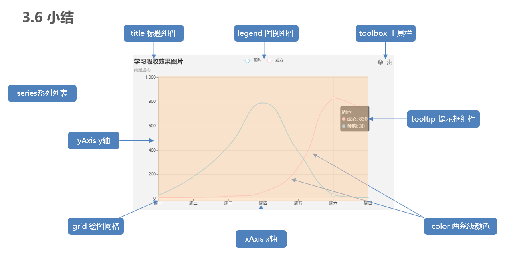

# 1.项目介绍与目标

CMS（content manage system）内容管理系统

## 1.1. 项目介绍

应对现在数据可视化的趋势，越来越多企业需要在很多场景(营销数据，生产数据，用户数据)下使用，可视化图表来展示体现数据，让数据更加直观，数据特点更加突出。

## 1.2. 重要的三个地址

- **接口文档地址**：https://docs.apipost.cn/preview/ebfa24f6d27e4f89/cf3af015f5ca6674
- **接口根路径**：http://www.itcbc.com:8000
- **线上演示地址**：http://www.itcbc.com:8888/login.html

## 1.3. 资源说明

- 仓库地址：https://gitee.com/lv-chao123/cms

  ```bash
  # 克隆master分支
  git clone git@gitee.com:lv-chao123/cms.git
  或
  git clone https://gitee.com/lv-chao123/cms.git
  ```

## 1.4. 课程目标

- 实战Ajax在项目中的应用
- 掌握echarts的基本使用
- 增强对数据的处理能力，增强编程能力

# 2. ECharts介绍

ECharts官方网站传送门：[https://echarts.apache.org/handbook/zh/get-started](https://echarts.apache.org/handbook/zh/get-started)

## 2.1. Echarts-介绍

由百度开源，托管给了Apache公司进行维护，导致现在echarts社区也失效了

> ECharts，一个使用 JavaScript 实现的开源可视化库，可以流畅的运行在 PC 和移动设备上，兼容当前绝大部分浏览器（IE8/9/10/11，Chrome，Firefox，Safari等），底层依赖矢量图形库 [ZRender](https://github.com/ecomfe/zrender)，ZRender底层又依赖canvas。提供直观，交互丰富，可高度个性化定制的数据可视化图表。

大白话：

- 是一个JS插件
- 性能好可流畅运行PC与移动设备
- 兼容主流浏览器
- 提供很多常用图表，且可**定制**。

注意点：

* 有的复杂的图形，还可能有一些配置文件（需要一点一点分析）
* 一般就是从官方文档找代码，然后按照需求，修改一些信息
* 第一次定义option（配置项）记得let声明一下。多个option
* option对象里面存有下面的这些基本配置，其他的函数之类的东西可能是为了做动态的效果（在官网配置项中查看）

## 2.2. Echarts-体验

官方教程：[五分钟上手ECharts](https://echarts.apache.org/handbook/zh/get-started/)

步骤：

- 下载echarts  https://echarts.apache.org/zh/download.html
- 引入echarts  `dist/echarts.min.js`
- 准备一个具备大小（宽高）的 DOM

```html
<div id="main" style="width: 600px;height:400px;"></div>
```

- 初始化echart实例

```js
var myChart = echarts.init(document.getElementById('main'));
```

- 指定图表的配置项和数据 (根据文档提供示例找到option)

```js
let option = {
    xAxis: {
        type: 'category',
        data: ['Mon', 'Tue', 'Wed', 'Thu', 'Fri', 'Sat', 'Sun']
    },
    yAxis: {
        type: 'value'
    },
    series: [{
        data: [820, 932, 901, 934, 1290, 1330, 1320],
        type: 'line'
    }]
};
```

- 使用刚指定的配置项和数据显示图表

```js
myChart.setOption(option);
```

> echarts.js适合开发环境（可以读源码），echarts.min.js适合生产环境（不换行，变量用简单的二十六个字母，体积更小）

全局 echarts 对象，在 script 标签引入 `echarts.js` 文件后获得。调用`ECharts.init(elment)`方法创建ECharts实例（echartsinstance）从而调用ECharts库提供的很多方法，不能在单个容器上初始化多个 ECharts 实例。

## 2.3. Echarts-基础配置

> 需要了解的主要配置： `xAxis` `yAxis` `grid` `title` `tooltip` `legend` `color` `toolbox` `series`

- xAxis：直角坐标系 grid 中的 x 轴
  - type  x轴就是类目值  张三 李四 王五这些同类的数据就叫类目数据  星期一 星期二也是类目属性 type=“category”
       	boundaryGap：值和刻度的位置
       	data：x轴属性值
- yAxis：直角坐标系 grid 中的 y 轴
  - y轴一般用value（值会根据series的最大值自动生成），x轴用category（不设置data，继承series的data值）
- grid：直角坐标系内绘图网格
  - containLabel 是否是以x轴 y轴上的数值为基准  在设置网格位置的时候
- title：标题组件
- tooltip：提示框组件（hover图标后出现的提示框，很多地方都可以设置，这个是全局的提示框）
  - textStyle
  - formatter可以修改提示框的布局样式
- legend：图例组件
  - 就一个摆放位置有关，不设置data好一点，具体折线的name会自动显示出来，设置错了就显示不出
- color：调色盘颜色列表
- toolbox 工具盒子（比如下载功能）
- series
  - 系列列表。每个系列通过 `type` 决定自己的图表类型，"pie",饼图  line折线图  bar柱形图也叫折线图  不同的type属性设置也不一样
  - stack 数据堆叠 可以数据累加，name 图例legend名字，data:图表中的数据
  - 大白话：图标数据，指定什么类型的图标，可以多个图表重叠。


一定要看得懂文档怎么写的
文档对应代码设置
grid:{
    show:true
}

> 技巧：
>
> * 去示例里面去找类似的图标，看自己需要什么，看是什么属性，直接在配置项里面找的话太累了
> * 可以在echarts官网文档调试好了（所有参数都调试好了复制粘贴到vscode）
> * 很多时候直接用默认值就可以了
> * 一般掌握一下官网示例的前几个简单的就可以了，足以应付大多数
> * 地图地球gl一般需要引入额外的第三方脚本文件



演示代码：

```js
var option = {
    xAxis: {
        type: 'category',
        data: ['Mon', 'Tue', 'Wed', 'Thu', 'Fri', 'Sat', 'Sun']
    },
    yAxis: {
        type: 'value'
    },
    series: [{
        data: [820, 932, 901, 934, 1290, 1330, 1320],
        type: 'line',
        name:'线形图'
    },
    {
        data: [22, 333, 111, 222, 444, 666, 777],
        type: 'bar',
        name:'饼状图'
    }],
    grid: {
        show: true
    },
    title: {
        text: '标题'
    },
    tooltip: {
        padding: 20
    },
    legend: {
        data: ['线形图']
    },
    color: ['red','green']
};
```

## 2.4. Echarts-饼图

### 步骤分析

1. 封装好函数，为后续传入真实数据做准备
2. 初始化echarts
3. 设置配置项，空的 option 即可
4. 创建图表
5. 查找官方示例
6. 按需求，自定义配置图表

### 第一步：echarts基本步骤

```js
function pieChart() {
  let myChart = echarts.init(document.querySelector('.pie'));
	let option = {};
	myChart.setOption(option);
}
```

### 第二步：参照官方示例

（官方示例：https://echarts.apache.org/examples/zh/editor.html?c=pie-roseType-simple）

- 只留下series系列数据配置，其他全部删除。

### 第三步：自定义配置

- 增加标题，标题颜色 #6d767e
- 增加鼠标移入提示。（比如：“各地学员分布  北京市  12人 占比6.8%”）
- 系列数据
  - 修改 name 为 '各地学员分布'
  - 饼图，内圈半径 10%，外圈半径 60%
  - 居中显示
  - 面积模式
  - 扇形轮廓圆角（4px）

完成后的配置项如下：

```js
let option = {
  tooltip: {
    // {a} 表示series中的name
    // {b} 表示数据中的series.data中的name
    // {c} 表示每一项的值
    // {d} 表示百分比
    formatter: '{a} <br />{b} <strong>{c}</strong>人 占比{d}%'
  },
  title: {
    text: '籍贯 Hometown',
    textStyle: {
      color: '#6d767e' // 标题演示
    },
  },
  series: [
    {
      name: '各地学员分布',
      type: 'pie', // pie 表示饼图
      radius: ['10%', '65%'], // 内外圈的半径
      center: ['50%', '50%'], // 中心点
      roseType: 'area', // area表示面积模式，radius表示半径模式
      itemStyle: { // 每一项的设置
        borderRadius: 4, // 扇形边缘圆角设置
      },
      data: [
        { value: 40, name: '北京' },
        { value: 38, name: '山东' },
        { value: 32, name: '上海' },
        { value: 30, name: '江苏' },
        { value: 28, name: '河北' },
        { value: 26, name: '山西' },
        { value: 22, name: '河南' },
        { value: 18, name: '辽宁' }
      ]
    }
  ]
};
```

## 2.5. Echarts-折线图

### 步骤分析

1. 封装好函数，为后续传入真实数据做准备
2. 初始化echarts
3. 设置配置项，空的option 即可
4. 创建图表
5. 查找官方示例
6. 按需求，自定义配置图表

### 第一步：echarts基本步骤

```js
function lineChart() {
  let myChart = echarts.init(document.querySelector('.line'));
  let option = {};
  myChart.setOption(option);
}
```

### 第二步：参照官方示例

（官方示例：https://echarts.apache.org/examples/zh/editor.html?c=area-simple）

- tooltip -- 输入移入的提示
- title  --  标题
- xAxis  -- x轴
- yAxis  --  y轴
- dataZoom  --  数据缩放组件
- series  --  系列数据

以上配置项留下，其他删除

### 第三步：自定义配置

- 将官方示例中除了option之外的其他代码删除，并自己添加X轴数据和series中的数据。
- 系列数据
  - 增加一条线
  - 修改 name 为 '期望薪资' 和 '实际薪资'
  - 线的拐点为平滑拐点
  - 线条和X轴对齐位置，无特殊标记 `symbol: 'none'`

- 分析数据缩放组件 `dataZoom`
- 增加标题，标题颜色 #6d767e
- 分析tooltip（官方示例已带）。
- 增加图例，距离顶部20px。
- 分析坐标轴留白策略 `boundaryGap`

完成后的配置项 option 如下：

```js
let option = {
  // 图例
  legend: {
    top: 20,
  },
  // 鼠标移入的提示
  tooltip: {
    trigger: 'axis', // 轴触发
    position: function (pt) {
      // pt是一个数组，pt[0]表示横坐标位置，'10%'表示Y轴方向始终保持距离顶部10%的距离
      // 所以意思是，提示框的位置会跟随鼠标左右移动，但纵向上的位置始终保持不变。
      return [pt[0], '10%']; 
    }
  },
  // 标题
  title: {
    text: '薪资 Salary',
    textStyle: {
      color: '#6d767e'
    }
  },
  xAxis: {
    type: 'category',
    boundaryGap: false, // x轴两边的留白策略，false表示不留空白
    data: ['张三', '李四', '张飞', '赵云', '狗哥', '张三', '李四', '张飞', '赵云', '狗哥', '张三', '李四', '张飞', '赵云', '狗哥', '张三', '李四', '张飞', '赵云', '狗哥']
  },
  yAxis: {
    type: 'value',
    // Y轴类型为value，则留白策略指的是对数据的延伸。
    // 比如，图表中的数据最大值是17000，则Y轴最大数字大约是 17000 + 17000 * 50%
    boundaryGap: [0, '50%'],
  },
  // 数据缩放组件
  dataZoom: [
    // {
    //   type: 'inside', // 将拖动的条内置到轴里面，看不见了，但是可以拖动
    //   start: 0,
    //   end: 10
    // },
    {
      type: 'slider', // 拖动条显示到轴的外面（默认就是slider类型）
      start: 0, // 拖动滑块起始位置（这是一个百分比）
      end: 15 // 拖动滑块结束位置（这是一个百分比）
    }
  ],
  // 数据部分
  series: [
    {
      name: '期望薪资',
      type: 'line',
      smooth: true, // 表示使用平滑曲线
      symbol: 'none', // 线上拐点位置的样式，none表示没有；也可以是实心圆、空心圆、方块.....
      itemStyle: { // 单独控制这条线的颜色
        color: '#ee6666'
      },
      data: [8300, 9600, 15000, 17000, 12000, 8300, 9600, 15000, 17000, 12000, 8300, 9600, 15000, 17000, 12000, 8300, 9600, 15000, 17000, 12000]
    },
    {
      name: '实际薪资',
      type: 'line',
      smooth: true,
      symbol: 'none',
      itemStyle: { // 单独控制这条线的颜色
        color: '#5470c6'
      },
      data: [9600, 15000, 17000, 12000, 8300, 9600, 15000, 17000, 12000, 8300, 9600, 15000, 17000, 12000, 8300, 9600, 15000, 17000, 12000, 13000]
    }
  ]
};
```

## 2.6. Echarts-柱状图

### 步骤分析

1. 封装好函数，为后续传入真实数据做准备
2. 初始化echarts
3. 设置配置项，空的option 即可
4. 创建图表
5. 查找官方示例
6. 按需求，自定义配置图表

### 第一步：echarts基本步骤

```js
function barChart() {
  let myChart = echarts.init(document.querySelector('.barChart'));
  let option = {}
  myChart.setOption(option);
}
```

### 第二步：参照官方示例

（官方示例：https://echarts.apache.org/examples/zh/editor.html?c=mix-line-bar）

- tooltip 提示组件
- legend 图例
- xAxis x轴
- yAxis y轴
- series 系列数据

以上几个配置项留下，其他删除。

### 第三步：自定义配置

- 修改X轴及series中的数据

  ```js
  ['1组', '2组', '3组', '4组', '5组', '6组', '7组']
  [83, 57, 90, 78, 66, 76, 77, 87, 69, 92, 88, 78]
  [2, 1, 3, 4, 2, 5, 2, 2, 4, 1, 6, 2]
  [3, 2, 1, 5, 1, 2, 3, 4, 5, 2, 2, 4]
  [3, 2, 1, 5, 1, 2, 3, 4, 5, 2, 2, 4]
  ```

- 多个Y轴
  - 第一个y轴（**索引0**）表示平均分，范围0~100，根据数字10，将Y轴分为10份
  - 第二个y轴（**索引1**）表示人数，范围0~10（根据班级情况而定），根据数字1，将y轴分为10份。
- 系列数据
  - 增加至 4 组数据，并修改每组 name 
  - 修改每个柱子的宽度为 15px
  - 让平均分使用第一个Y轴（`yAxisIndex: 0`），让人数使用第二个Y轴（`yAxisIndex: 1`）
- 调整网格（图表的宽高）
  
  - 上下 30px，左右 7%
- 分析tooltip（官方示例已带）

```js
let option = {
  // 网格（整个图表区域设置）
  grid: {
    top: 30,
    bottom: 30,
    left: '7%',
    right: '7%'
  },
  // 鼠标移入的提示
  tooltip: {
    trigger: 'axis', // 触发方式，axis表示轴触发，item表示每一项
    axisPointer: {   // 坐标轴指示器配置项
      // 十字准星指示器，其他选项有 line、shadow、none（这里配合x轴的设置，组成的十字准星）
      type: 'cross', 
      crossStyle: {
        color: '#999'
      }
    }
  },
  // 图例
  legend: {},
  // X轴
  xAxis: [
    {
      type: 'category',
      data: ['1组', '2组', '3组', '4组', '5组', '6组', '7组'],
      axisPointer: { // 坐标轴指示器为阴影，配合tooltip中的设置，组成十字准星
        type: 'shadow'
      }
    }
  ],
  // Y轴
  yAxis: [
    {
      type: 'value',
      min: 0, // y轴数据最小值
      max: 100, // y轴数据最大值
      interval: 10, // step步长，把y轴的数据分成多少份
      axisLabel: { // Y轴文字设置
        formatter: '{value}分', // Y轴文字
      }
    },
    {
      type: 'value',
      min: 0,
      max: 10,
      interval: 1,
      axisLabel: {
        formatter: '{value}人'
      }
    }
  ],
  // 数据部分（4组数据）
  series: [
    {
      name: '平均分',
      type: 'bar',
      data: [83, 57, 90, 78, 66, 76, 77, 87, 69, 92, 88, 78],
      barWidth: '15',
    },
    {
      name: '低于60分人数',
      type: 'bar',
      data: [2, 1, 3, 4, 2, 5, 2, 2, 4, 1, 6, 2],
      barWidth: '15',
      yAxisIndex: 1, // Y轴索引，1表示使用第2个Y轴
    },
    {
      name: '60到80分之间',
      type: 'bar',
      yAxisIndex: 1, // Y轴索引，1表示使用第2个Y轴
      barWidth: '15',
      data: [1, 4, 2, 4, 5, 2, 1, 3, 3, 2, 2, 4]
    }
    ,
    {
      name: '高于80分人数',
      type: 'bar',
      yAxisIndex: 1, // Y轴索引，1表示使用第2个Y轴
      barWidth: '15',
      data: [3, 2, 1, 5, 1, 2, 3, 4, 5, 2, 2, 4]
    }
  ]
};
```

## 2.7. Echarts社区

> 社区就是一些，活跃的echart使用者，交流和贡献定制好的图表的地方。

在这里可以找到一些基于echart的高度定制好的图表，相当于基于jquery开发的插件，这里是基于echarts开发的第三方的图表。

社区示例（官方网站托管给Apach后停服）：https://www.makeapie.com/explore.html

替代网站：

1. [https://www.isqqw.com/homepage#/homepage](https://www.isqqw.com/homepage#/homepage)
2. [https://www.makeapie.cn/echarts](https://www.makeapie.cn/echarts)
3. [http://ppchart.com/#/](http://ppchart.com/#/)
4. [http://analysis.datains.cn/finance-admin/index.html#/chartLib/all](http://analysis.datains.cn/finance-admin/index.html#/chartLib/all)


## 2.8. Echarts-使用社区的示例

项目中使用的社区示例地址：https://www.makeapie.com/editor.html?c=xD4a1EBnvW

重点：

- 使用社区示例，必须要查看示例引入了哪些外部js文件。

实现步骤：

- 第一需要下载china.js提供中国地图的js文件
- 导入后，直接使用社区提供的配置即可。
- 自行修改
  - 将背景色改为 白色
  - 将 视觉映射组件（`visualMap`）中的 `show` 改为 `false`
  - 其他自行自愿修改。

必须知道的结论：

- 哪些数据和哪些数据是对应的，必须一致
- 哪些数据能多，能错
- 哪些数据不能多，不能错

# 3. 项目开始

## 3.1. 插件介绍

### 提示框插件

- 提示框插件有很多，不同的框架中选择的也不一样。
- 案例中，提示框使用的是 [toastr](https://codeseven.github.io/toastr/demo.html) 插件。(挂的是GitHub链接，可能打不开)
- 总结它的使用步骤如下：

使用步骤：

1. 加载 toastr.css 和 toastr.js 文件（因为基于jquery需要导入jquery库）

2. 全局配置。为方便，我们将下面的配置放到 assets/utils/toastr.js 中，使用时，加载这个配置文件即可

   ```js
   toastr.options = {
     // "closeButton": false,
     // "debug": false,
     // "newestOnTop": false,
     // "progressBar": false,
     "positionClass": "toast-top-right", // 提示框位置，这里填类名
     // "preventDuplicates": false,
     // "onclick": null,
     "showDuration": "300",              // 提示框渐显所用时间
     "hideDuration": "300",              // 提示框隐藏渐隐时间
     "timeOut": "2000",                  // 提示框持续时间
     // "extendedTimeOut": "1000",
     // "showEasing": "swing",
     // "hideEasing": "linear",
     // "showMethod": "fadeIn",
     // "hideMethod": "fadeOut"
   }
   ```

3. 调用方法，直接使用

   ```js
   toastr.info('提示信息');                // 普通提示
   toastr.success('提示信息');             // 成功提示
   toastr.warning('提示信息');             // 警告提示
   toastr.error('提示信息');               // 错误提示
   ```

## 3.2. common.js

1. 设置ajax请求的根路径
2. 设置axios拦截器：
	请求拦截，url不含有api目录的加上请求头来传递token
	响应拦截
		正常响应：调用toastr库的提示框，拦截所有的业务状态码为1的错误信息
		响应失败：在身份认证失败时，仍然出现响应报文，在响应error里面的，分两种情况，跳过登录直接进入首页或者token失效，需要提示警告信息并跳转到login页面（注意iframe标签里面的在父窗口跳转）用if return取代if-else（叫做登录拦截）

### 3.2.1. 配置Axios项目根路径

- 目前echarts图表中的数据都是假数据

- 如果获取真数据就需要调用接口

- 这就需要至少要完成注册、登录、初始化数据等接口的调用才行

- 项目中接口根路径是相同的，见前文 [重要的三个地址](#重要的三个地址) 

- 所以，在 `assets/utils` 文件夹，创建axios的配置文件，取名 `common.js` 。代码如下：

  ```js
  axios.defaults.baseURL = 'http://www.itcbc.com:8000';
  ```

  > 这里之所以放到 assets/utils 文件夹中，是因为 utils 在编程中常用来放工具函数。而request是请求的意思。

### 3.2.2. axios拦截器

```js
axios.interceptors.request.use(function(config){
    // 发出请求之前在这
    // some code...
    return config
},function(error){
    // 请求没发出去在这 发送的途中出事（很少见）
    // some code...
    return Promise.reject(error)
})

axios.interceptors.response.use(function(response){
    // 收到响应报文之前在这
    // 404 url错误
    // some code
    return response
},function(error){
    // 收到响应报文出错
    // 400请求参数错误
    // 一般是 401/402/403 没有权限
    // 405请求方法错误
    // 5xx也在这
    // 接口错误状态处理，也就是说无响应时的处理（服务器挂了）
    return Promise.reject(error)
}
```

由于除了登录和注册接口外，其他所有接口都需要身份认证（都需要我们提供令牌），所以我们可以在 `request.js` 中，全局配置请求头。

```js
axios.defaults.headers.common['Authorization'] = localStorage.getItem('token');
```

当然常用的是在axios拦截器中，请求拦截器中设置

完整代码

```js
// 请求拦截器
axios.interceptors.request.use(function(config){
// 根据url判断加不加请求头，config就是axios实例的第一个括号中的对象
if(config.url.indexOf('/api/')==-1){
  // 点语法属于新增
config.headers.Authorization=localStorage.getItem('myToken')
}
  return config
},function(error){
  return Promise.reject(error)
})

// 响应拦截器，返回报错信息
axios.interceptors.response.use(function (response) {
    // 所有的响应前的报错信息
    if(response.data.code==1){
         return toastr.warning(response.data.message)
    }
    // 响应信息，无论如何处理记得返回
    return response;
  }, function (error) {
    /* 
      1.未登录，直接进入到首页
      2.token登录超过有效期
      两种情况都会导致身份认证失败
      总结：身份认证失败之后，要求跳转到登录页面（登录拦截）所有的大型项目都需要做这一步 */
    // 发送ajax请求后，身份认证失败，返回在拦截器的error对象中
    // console.dir(error)以对象形式输出结果
    console.log('错误在这')
    console.dir(error);
// error里面有response属性，response里面有data属性，data里面有message和code，为提高安全性，可以写全信息
/* if(error&&error.response&&error.response.data&&error.response.data.message=='身份认证失败') */
if(error.response.data.message=='身份认证失败'){
  // 强行跳转到登录页，销毁token（无效的token）
  toastr.warning('身份认证失败，正在跳转到首页...')
  // iframe标签的页面在身份认证失败时，要求它的父窗口index.html跳转，html文件新建好后，它的location.href就确定了
  if(location.href.indexOf('index.html')!=-1){
    // 不等于-1说明含有index.html需要直接跳转
    setTimeout(() => {
      location.href='./login.html'
      }, 2000);
  }else{
    console.log(location.href)
    // 不含有dashboard的location
    setTimeout(() => {
      window.parent.location.href='./login.html'
      }, 2000);
  }
  localStorage.removeItem('myToken') 
  return
}

  // 普通的响应错误，无法返回response响应报文
toastr.error(error.response.data.message)

    // 对响应错误做点什么
return Promise.reject(error);
});
```

## 3.3. login.js

1. 登录注册盒子切换
2. 盒子输入校验（用oninput事件，需要input框设置autocomplete="off"）
3. 登录按钮事件，ajax请求跳转到index页面，登录后最好使用localStorage存储起来，下次进入到login直接getItem免登陆

### 3.3.1. 切换登录和注册的盒子

登录和注册同在 login.html 中，因为定位的原因重叠在一起了。我们可以通过JS实现切换两个盒子

```js
// 切换两个盒子
document.querySelector('.login a').addEventLister('click', function () {
    document.querySelector('.login').style.display = 'none';
    document.querySelector('.register').style.display = 'block';
})
document.querySelector('.register a').addEventLister('click', function () {
    document.querySelector('.login').style.display = 'block';
    document.querySelector('.register').style.display = 'none';
})
```

### 3.3.2. 表单验证

多个表单需要验证，所以用函数包装起来

```js
// 需求：登录注册校验
let inp1=document.querySelector('.register [name="username"]')
let inp2=document.querySelector('.register [name="password"]')
let inp3=document.querySelector('.login [name="username"]')
let inp4=document.querySelector('.login [name="password"]')
// 封装校验函数
const verifyInput=(ele,txt1,reg,txt2)=>{
    // 绑定事件
ele.addEventListener('input',function(){
    // 非空判断
    if(!this.value.trim()){
    this.nextElementSibling.style.display='block'
    this.nextElementSibling.innerText=txt1
    // 如果判断出，已经是空白字符串，那么久不需要下面的正则表达式校验了
    return
    }else{
        this.nextElementSibling.style.display='none'
    }
    // 长度校验
    if(!reg.test(this.value.trim())){
        this.nextElementSibling.style.display='block'
    this.nextElementSibling.innerText=txt2
    }else{
        this.nextElementSibling.style.display='none'
    }
})
}
// 调用函数校验输入框（函数声明是提升到当前作用域的顶部）
verifyInput(inp1,'用户名不能为空',/^\S{2,15}$/,'用户名长度不能小于2位或者15位')
verifyInput(inp2,'密码不能为空',/^\S{6,15}$/,'密码长度不能小于2位或者15位')
verifyInput(inp3,'用户名不能为空',/^\S{2,15}$/,'用户名长度不能小于2位或者15位')
verifyInput(inp4,'密码不能为空',/^\S{6,15}$/,'密码长度不能小于6位或者15位')
```

### 3.3.3. 完成注册

当表单验证通过后，根据接口文档，获取输入框的账号和密码，Ajax提交账号和密码，注册一个账号

```js
const formReg=document.querySelector('.register form')
// onsubmit事件只对form和keygen标签生效，在表单提交时触发
formReg.addEventListener('submit',function(e){
    // 阻止表单默认提交
e.preventDefault()
// 发送ajax提交
axios({
    url:'/api/register',
    method:'post',
    // Content-type:application/x-www-form-urlencoded  username=admin&password=123456
    // Content-type:application/json  {username:admin,password:123456}
    // Content-type:application/form-data FormData对象

    // 接口提供的Content-type
    // data:`username=${inp1.value}&password=${inp2.value}`

    // jquery库提供的方法获取表单value，对应的是Content-type:application/x-www-form-urlencoded  data:'username=admin&password=123456'
    // 需要input的name值与接口中的参数名对应
    data: $(this).serialize()
}).then(({data:res})=>{
    //成功回调
    console.log(res)
    // 很多地方在发送ajax之前都会有响应报错信息，统一在拦截器中处理

   /*  if(res.code==1){
        return toastr.warning(res.message)
    } */

    // 响应成功的代码具有个性化，无法放在拦截器中
    toastr.success(res.message)
    // 注册成功后跳转到登录页
    a2.onclick()
    // 并且清空注册form表单
    formReg.reset()
})

})
```

### 3.3.4. 登录功能

- 因为前文已经完成了注册，所以这里的登录功能极为简单
- 问题是，登录如果成功，该做什么？
  - 将服务器响应的token存储到本地存储（关于token的说明见下文的 [JWT身份认证](##JWT身份认证)）
  - 跳转到 index.html 页面 （页面跳转，只考虑两个html之间的相对关系，不考虑js在哪里）

登录的代码如下：

```js
const formLogin=document.querySelector('.login form')
formLogin.addEventListener('submit',function(e){
e.preventDefault()
// 发送ajax
axios({
    url:'/api/login',
    method:'post',
    data: {
        username:inp3.value,
        password:inp4.value
    }
}).then(({data:res})=>{
    //成功回调
    console.log(res)
    // 错误信息在拦截其中实现
    // 这里只实现成功中提示
        toastr.success(res.message)
        // 跳转到首页，注意这里是以login.html为基准，防止跳转太快看不见提示信息，可以设置一个延迟器
        setTimeout(() => {
            location.href='./index.html'
        }, 1000);

    // 保存token 后面再看token怎么使用
    localStorage.setItem('myToken',res.token)
})
})
```

### 3.3.5. JWT身份认证

接口文档开头会告诉哪些接口需要访问权限


什么是jwt身份认证（JSON Web Token）？

传送门：[https://www.ruanyifeng.com/blog/2018/07/json_web_token-tutorial.html](https://www.ruanyifeng.com/blog/2018/07/json_web_token-tutorial.html)

在前后端分离模式的开发中，服务器如何知道来访者的身份呢？

- 在登录后，服务器会响应给用户一个 令牌 （token）
- 令牌中会包括该用户的id等唯一标识
- 浏览器收到令牌后，自己保存
- 下次请求其他接口时，（在请求头中）携带这个令牌去请求
- 这样服务器就知道来访者的身份了，服务器就会为该用户开发接口的访问权限，并处理该用户的数据


> 这样，就明白为什么登录后，要将token保存到本地存储中了。

## 3.4. index.js
### 3.4.1. 退出登录

一般来说，退出需要做的事和登录后做的事刚好相反。

- 登录后，在本地存储了token；退出时，移除这个token
- 登录后，跳转到了 index.html 页面；退出时，跳转到 login.html

```js
const logout=document.querySelector('.logout')
logout.addEventListener('click',function(){
  if(confirm('确认要退出登录吗？')){
    location.href='./login.html'
    // 销毁token，后面有具体的作用，推出的时候需要销毁
    localStorage.removeItem('myToken')
  }
})
```

### 3.4.2. 初始化数据

为了减少手动录入数据的时间，特别设计了此接口。调用此接口将为你随机添加56名同学，并分为8个组。并为每位同学随机添加了三次成绩。

```js
const init=document.querySelector('.init')
init.addEventListener('click',function(){
  // 发送ajax
  axios({
    url:'/init/data',
    // 添加token身份认证,Authorization
    // 每个都要设置的话太麻烦，直接抽离到common.js中
   /*  headers:{
    Authorization:localStorage.getItem('myToken') } , */
    method:'get'//请求方式默认就是get，不写默认就是get
  }).then(()=>{
      toastr.success('数据初始化成功')
      // 数据出来了，重新发送其他的ajax
      location.reload()
  })
})
```

## 3.5. dashboard.js

### 3.5.1. kpi的数据渲染

- 查阅接口文档，发现服务器已经将数据计算整理完毕，提供了现成的接口。
- 所以我们前端开发者，只需要调用接口，并将数据展示到页面中即可。

```js
axios({
  url:'/student/overview',
  method:'get'
}).then(({data:res})=>{
  // 业务状态码错误判断由拦截器完成
document.querySelector('.overview .total').innerHTML=res.data.total
document.querySelector('.overview .avgSalary').innerHTML=res.data.avgSalary
document.querySelector('.overview .avgAge').innerHTML=res.data.avgAge
document.querySelector('.overview .proportion').innerHTML=res.data.proportion
})
```

### 3.5.2. 点击成绩那的按钮显示隐藏成绩区域或者获取a标签绑定点击事件

渲染柱形图数据

````js
const btn =document.querySelector('.bar .btn'),
ul =document.querySelector('.bar ul')

btn.addEventListener('click',function(){
  if(ul.style.display=='none'){
    ul.style.display='block'
  }else{
    ul.style.display='none'
  }
})
````

```js
let as=ul.querySelectorAll('a')
// 获取的是伪数组
for(let i = 0;i<as.length;i++){
  as[i].onclick=function(){
// 发送ajax，获取指定次数的成绩信息
axios({
  url:'/score/batch',
  method:'get',
  params: { batch:i+1}
}).then(({data:res})=>{
    // 响应成功
    setBar(res.data)
})
  }
}
// 页面一加载需要显示第一组的数据
as[0].onclick()
```

### 3.5.3. 柱状图使用接口数据

- 这个接口和班级概况一样，服务器已经将数据整理完毕。
- 所以我们前端开发者，只需要调用接口获取数据，并将数据传递给 echarts 即可。
- 不过，接口需要一个 batch 参数（考试的次数），所以需要先将下拉菜单处理一下。

创建柱状图的函数，设置形参接收数据。并把数据应用到X轴及series中。

```js
const setBar=(obj)=>{
  let myChart=echarts.init(document.querySelector('.barChart'))
  let option = {
    // 网格整个图表区域设置
    grid:{
    top:30,bottom:30,left:'7%',right:'7%'
    },
    tooltip: {
      // 不设置position和formatter会有默认值
      trigger: 'axis',
      axisPointer: {//cross是十字准星指示器，其他选项有 line、shadow、none（这里配合x轴的设置，组成的十字准星）
        type: 'cross',//有x轴shadow不明显
        crossStyle: {
          color: '#999'
        }
      }
    },
    // 删除toolbox组件
    legend: {
      // data默认和series里面的name属性一致
      // data: ['Evaporation', 'Precipitation', 'Temperature']
    },
    xAxis: [
      {
        type: 'category',
        data: obj.group,
        axisPointer: {
          type: 'shadow'//鼠标放在x轴元素上，出现阴影
        }
      }
    ],
    yAxis: [
      {
        type: 'value',
        // name属性是坐标轴上的说明文字，删除
        min: 0,//最小值
        max: 100,//最大值
        interval: 10,//坐标轴数值间隔
        // axisLabel是坐标轴刻度标签相关设置
        axisLabel: {
          formatter: '{value}分'//formatter是显示内容格式化
        }
      },
      {
        type: 'value',
        min: 0,
        max: 10,
        interval: 1,
        axisLabel: {
          formatter: '{value}人'
        }
      }
    ],
    series: [
      {
        name: '平均分',
        type: 'bar',
        barWidth:15,//设置柱子宽度
        yAxisIndex:0,// Y轴索引，0表示第一个y轴，1表示使用第2个Y轴
        // 单个元素可以单独设置提示框tooltip，当前不需要，删除
        data: obj.avgScore
      },
      {
        name: '低于60分人数',
        type: 'bar',
        barWidth:15,
        yAxisIndex:1,
        data: obj.lt60
      },
      {
        name: '60到80分之间',
        type: 'bar',
        barWidth:15,
        yAxisIndex: 1,
        data: obj.gt60
      },
      {
        name: '80分以上',
        type: 'bar',
        barWidth:15,
        yAxisIndex: 1,
        data: obj.gt80
      }
    ]
  };
  myChart.setOption(option)
}
```

### 3.5.4. 折线图使用接口数据

> 为了断链数据处理能力。所以并没有提供 “返回折线图数据” 的接口。我们需要调用获取学生接口，然后自己处理数据。

调用“获取学生”接口，然后处理

```js
const setLine=(obj)=>{
  let myChart=echarts.init(document.querySelector('.panel.line'))
  let option = {
    tooltip: {
      trigger: 'axis',
      position: function (pt) {
        return [pt[0], '10%'];
      }
    },
    title: {
      text:"薪资 Salary",
      color:'#6d767e'
    },
    // 删除工具栏组件，新增图例legend组件
    legend:{},
    xAxis: {
      // x轴一般设置为category类目数据，未设置data，从series获取
      type: 'category',
      boundaryGap: false,
      data: obj.name
    },
    yAxis: {
      // y轴一般为value值，会根据series的data最大值自动生成
      type: 'value',
      boundaryGap: [0, '100%']
    },
    // 数据缩放组件
    dataZoom: [
        // inside为鼠标滚轮缩放,将拖动的条内置到轴里面，看不见了，但是可以拖动
      {
        // 不设置type默认为slider
        // slider为滑动条缩放
        type:'slider',
        start: 0,//百分比
        end: 10
      }
    ],
    // series指的是每条折线的设置，对象数组，多个对象对应每条折线（数据部分）
    series: [
      {
        // name系列名称，用于tooltip提示框的显示，legend 的图例筛选，在 setOption 更新数据和配置项时用于指定对应的系列
        name: '期望薪资',
        type: 'line',
        smooth:true,
        symbol: 'none',//线上拐点位置的样式
        itemStyle: {
          // 单独控制这条颜色
          color: '#ee6666'
        },
        // 删除了areaStyle，不需要生成面积图
        // 一般y轴为value不设置data就参考series里面的数据生成一个范围数据
        data: obj.salary
      },
      {
        name: '实际薪资',
        type: 'line',
        symbol: 'none',
        smooth:true,
        itemStyle: {
          color: '#5470c6'
        },
        data: obj.truesalary
      }
    ]
  };
  myChart.setOption(option)
}
```

### 3.5.5. 地图使用接口数据

地图中使用的数据，只有地名和经纬度。这些数据在 “获取学生”接口中都有，但还是需要我们自己整理。锻炼数据处理能力。

由于前面已经调用过获取学生接口了，所以不用重新发送请求获取数据了，只需要处理即可。

```js
const setMap=(obj,arr)=>{
let myChart=echarts.init(document.querySelector('.map'))

  // 位置 + 经纬度
  var chinaGeoCoordMap = obj
  /* {
    "顺义校区": [
        116.4551,
        40.2539
    ],
    "海拉尔区": [
        119.736279,
        49.212189
    ],
    "市中区": [
        116.997777,
        36.651474
    ],
}; */
  var chinaDatas = arr
// 数据格式不是我们能决定的

  /* [
    [
        {
            "name": "海拉尔区",
            "value": 0
        }
    ],
    [
        {
            "name": "市中区",
            "value": 0
        }
    ],
]; */

  var convertData = function (data) {
    var res = [];
    for (var i = 0; i < data.length; i++) {
      var dataItem = data[i];
      var fromCoord = chinaGeoCoordMap[dataItem[0].name];
      var toCoord = [116.4551, 40.2539]; // 目标点经纬度（北京顺义校区）
      if (fromCoord && toCoord) {
        res.push([{
          coord: fromCoord,
          value: dataItem[0].value
        }, {
          coord: toCoord,
        }]);
      }
    }
    return res;
  };
  var series = [];
  [['顺义校区', chinaDatas]].forEach(function (item, i) {
    series.push({
      type: 'lines',
      zlevel: 2,
      effect: {
        show: true,
        period: 4, //箭头指向速度，值越小速度越快
        trailLength: 0.02, //特效尾迹长度[0,1]值越大，尾迹越长重
        symbol: 'arrow', //箭头图标
        symbolSize: 5, //图标大小
      },
      lineStyle: {
        normal: {
          width: 1, //尾迹线条宽度
          opacity: 1, //尾迹线条透明度
          curveness: 0.2 //尾迹线条曲直度
        }
      },
      data: convertData(item[1])
    }, {
      type: 'effectScatter',
      coordinateSystem: 'geo',
      zlevel: 2,
      rippleEffect: { //涟漪特效
        period: 4, //动画时间，值越小速度越快
        brushType: 'stroke', //波纹绘制方式 stroke, fill
        scale: 4 //波纹圆环最大限制，值越大波纹越大
      },
      label: {
        normal: {
          show: true,
          position: 'right', //显示位置
          offset: [5, 0], //偏移设置
          formatter: function (params) {//圆环显示文字
            return params.data.name;
          },
          fontSize: 12
        },
        emphasis: {
          show: true
        }
      },
      symbol: 'circle',
      symbolSize: function (val) {
        return 4 + val[2] * 5; //圆环大小
      },
      itemStyle: {
        normal: {
          show: false,
          color: '#f00'
        }
      },
      data: item[1].map(function (dataItem) {
        return {
          name: dataItem[0].name,
          value: chinaGeoCoordMap[dataItem[0].name].concat([dataItem[0].value])
        };
      }),
    },
      //被攻击点
      {
        type: 'scatter',
        coordinateSystem: 'geo',
        zlevel: 2,
        rippleEffect: {
          period: 4,
          brushType: 'stroke',
          scale: 4
        },
        label: {
          normal: {
            show: true,
            position: 'right',
            offset: [5, 0],
            color: '#9eca7f', // 目标点文字颜色
            formatter: '{b}',
            textStyle: {
              color: "#9eca7f"
            }
          },
          emphasis: {
            show: true,
            color: "#f60", // 目标点鼠标移入的颜色
          }
        },
        symbol: 'pin',
        symbolSize: 50,
        data: [{
          name: item[0],
          value: chinaGeoCoordMap[item[0]].concat([10]),
        }],
      }
    );
  });

  let option = {
    title: {
      text: '来京路线 From',
      textStyle: {
        color: '#6d767e'
      }
    },
    // tooltip: {
    //   trigger: 'item',
    //   backgroundColor: 'rgba(166, 200, 76, 0.82)',
    //   borderColor: '#FFFFCC',
    //   showDelay: 0,
    //   hideDelay: 0,
    //   enterable: true,
    //   transitionDuration: 0,
    //   extraCssText: 'z-index:100',
    //   formatter: function (params, ticket, callback) {
    //     //根据业务自己拓展要显示的内容
    //     var res = "";
    //     var name = params.name;
    //     var value = params.value[params.seriesIndex + 1];
    //     res = "<span style='color:#fff;'>" + name + "</span><br/>数据：" + value;
    //     return res;
    //   }
    // },
    // backgroundColor: "#013954",
    // visualMap: { //图例值控制
    //   min: 0,
    //   max: 1,
    //   calculable: true,
    //   show: false,
    //   color: ['#f44336', '#fc9700', '#ffde00', '#ffde00', '#00eaff'],
    //   textStyle: {
    //     color: '#fff'
    //   }
    // },
    geo: {
      map: 'china',
      zoom: 1.2,
      label: {
        emphasis: {
          show: false
        }
      },
      roam: true, //是否允许缩放
      itemStyle: {
        normal: {
          // color: 'rgba(51, 69, 89, .5)', //地图背景色
          // color: '#5a6fc0', //地图背景色
          // borderColor: '#516a89', //省市边界线00fcff 516a89
          borderWidth: 1
        },
        emphasis: {
          color: 'rgba(37, 43, 61, .5)' //悬浮背景
        }
      }
    },
    series: series
  };
myChart.setOption(option)
}
```

> 上述数据，用的是省的名字，实际上全部用市的名字或者县的名字都可以。只要对应上即可。
>
> **我们案例中用县的名字。**

### 3.5.6. 饼图使用接口数据

```js
const setPie=(arr)=>{
    let myChart=echarts.init(document.querySelector('.panel.pie'))
    let option = {
        // 设置标题
        title:{
            text:"籍贯 Hometown",
            textStyle:{
                color:"#6d767e"
            }
        },
        // 图例legend组件删除

        // 工具栏toolbox删除

        // 提示器组件
        tooltip:{
            // {a}{系列名称}{b}{数据项名称}{c}{数值}{d}{百分比}
            // 各地人员分布<br>江苏省<b>7</b>人 占比12.5%
            formatter:'{a}<br>{b}<b>{c}</b>人 占比{d}%'
        },
        series: [
          {
            name: '各地人员分布',
            type: 'pie',
            // 内圆半径，外圆半径
            radius: ['10%', '60%'],
            // 圆心位置
            center: ['50%', '50%'],
            // 面积模式或者半径模式
            roseType: 'area',
            itemStyle: {
                // 圆角
              borderRadius: 4
            },
            data: arr
          }
        ]
      };
    myChart.setOption(option)
}
```

### 3.5.7. 处理服务器的数据

```js
// 7.完成折线图、饼图二号地图数据的数据渲染，来源于同一个接口地址
// 页面一加载，立刻发送ajax
axios({
  url:'/student/list',
}).then(({data:res})=>{
  //成功回调
  console.log(res)
  // 定义三个数组，循环遍历res.data，向数组中添加指定内容
  // let arr1=[],arr2=[],arr3=[]
  // 初始化数据空框架
    let lineData={
      name:[],
      salary:[],
      truesalary:[]
    }

    let pieData=[]

    let mapData1={ "顺义校区": [ 116.4551, 40.2539] },//需要设置第一个成员为默认的目的地，在ECharts给的代码里面有说
    mapData2=[]

  
    // 循环遍历，折线图、饼形图、地图都要用到这个循环，写在一个里面即可
    res.data.forEach(item=>{
      // 1.生成line的数据
      lineData.name.push(item.name)
      lineData.salary.push(item.salary)
      lineData.truesalary.push(item.truesalary)

      // 2.生成饼形图的数据，需要的是对象数组{{ value: 40, name: 'rose 1' },{...}] value 是每个省份的数量
      /*思路：数组没有该省份则push一个数据，value置为1，name为item.province
              数组有该省份则该元素的成员value++，同时需要知道该省份的下标用findIndex方法实现
        */    
        // 判断指定省份的人，在数据中是否存在和获取它的下标，所以pieData的下标需要存储起来
        let index=pieData.findIndex(ele=>ele.name==item.province)
    if(index==-1){
      pieData.push({
          value:1,
          name:item.province
        })
    }else{
      pieData[index].value++
    }
      // 3.生成地图数据
    // mapData1的格式  {"顺义校区": [116.4551,40.2539],...}
    // mapData2的格式  [[{"name": "海拉尔区","value": 0}],[...]]
    // 同第二步中的思路一样

    // 对象里面添加成员，原来属性和值存在的话，覆盖掉就可以了
    mapData1[item.county]=[item.jing,item.wei]

    // 数组里面添加数据
    let i=mapData2.findIndex(ele=>ele[0].name==item.county)
    if(i==-1){
      // 数组中没有指定的元素
    mapData2.push([{name:item.county,value:1}])
    }else{
      // 数组中有对应的元素，value值加1
    mapData2[i][0].value++
    }
    })
    
    setLine(lineData)
    setPie(pieData)
    setMap(mapData1,mapData2)
})
```

## 3.6. student.js

```js
// 学生信息界面

// 需求1：展示学生列表信息
// 根据图书管理系统，展示学生信息封装成一个函数，将来增删改完成后都可以再次调用刷新页面中的最新数据（因为还有别人来上传删除后台的数据），保证页面时刻都是最新的数据
function initStuList(){
    axios({
        url:'/student/list'
    }).then(({data:res})=>{
        document.querySelector('tbody').innerHTML=res.data.map(item=>`<tr>
            <th scope="row">${item.id}</th>
            <td>${item.name}</td>
            <td>${item.age}</td>
            <td>${item.sex}</td>
            <td>${item.group}</td>
            <td>${item.phone}</td>
            <td>${item.salary}</td>
            <td>${item.truesalary}</td>
            <td>${item.province+item.city+item.county}</td>
            <td>
                <button type="button" class="update btn btn-primary btn-sm" data-bs-toggle="modal" data-bs-target="#updateModal" data-id="${item.id}">修改</button>
                <button type="button" class="delete btn btn-danger btn-sm" data-id="${item.id}">删除</button>
            </td>
        </tr>`).join('')
    })
}
// 声明了一定要调用
initStuList()

// 需求2：删除功能，动态生成的元素，需要绑定事件，使用事件委托来处理
document.querySelector('tbody').onclick=function(e){
    // 判断是否是目标子元素
if(!e.target.classList.contains('delete')) return
    // 提示是否删除的确认信息
if(!confirm('是否要删除吗？')) return
// 获取自定义属性
let id=e.target.getAttribute('data-id')
// 发送ajax请求
axios({
    url:'/student/delete',
    method:'delete',
    params: {id}
}).then(({data:res})=>{
    toastr.success('删除成功!')
    // 重新请求最新列表
    initStuList()
})
}

// 需求3:省市区三级联动,需要用函数封装
const addForm=document.querySelector('.add-form')
const updateForm=document.querySelector('.update-form')

// 封装获取省市区函数
const initPlace=(form)=>{
    let sel1=form.querySelector('[name="province"]')

    // 发送ajax获取省份，并渲染到页面
    axios({
        url:'/geo/province'
    }).then(({data:res})=>{
        let arr=res.map(item=>`<option value="${item}">${item}</option>`)
        // 加上最前面的标签
        arr.unshift('<option selected value="">--省--</option>')
        sel1.innerHTML=arr.join('')
    })

    // 由省份的selected属性来触发市，达到省市联动
    let sel2=form.querySelector('[name="city"]')
    // 用change事件来监听sel1的变化
    sel1.onchange=function(){
        // 省发生改变，直接修改市和区的value，后面还没渲染出数据，用innerHTML
        sel3.innerHTML='<option selected value="">--县--</option>'
        // 省发生改变，省份选择默认的--省--标签，即没有选择省份，那么清空 市
        if(sel1.value==''){
            sel2.innerHTML='<option selected value="">--市--</option>'
            return
        }
        // 省份选择默认的--省--标签

        axios({
            url:'/geo/city',
            params: {pname:this.value}
        }).then(({data:res})=>{
            //成功回调
            // console.log(res)
            let arr=res.map(item=>`<option value="${item}">${item}</option>`)
            arr.unshift('<option selected value="">--市--</option>')
            sel2.innerHTML=arr.join('')
        })
    }

    // 由市的selected属性来触发区，达到市区联动
    let sel3=form.querySelector('[name="county"]')
    // 用change事件来监听sel1，sel2的变化
    sel2.onchange=function(){
        // 市发生改变，值为空，选择为默认的--市-- 那么清空区县
        if(this.value==''){
            sel3.innerHTML='<option selected value="">--县--</option>'
            return
        }
        axios({
            url:'/geo/county',
            params: { 
                pname:sel1.value,
                cname:sel2.value
            }
        }).then(({data:res})=>{
            //成功回调
            // console.log(res)
            let arr=res.map(item=>`<option value="${item}">${item}</option>`)
            arr.unshift('<option selected value="">--县--</option>')
            // 渲染到页面
            sel3.innerHTML=arr.join('')
        })
    } 
}
// 调用函数
initPlace(addForm)
initPlace(updateForm)

// 需求4：获取新增学员信息
// 表单注册事件
addForm.addEventListener('submit',function(e){
    e.preventDefault()
    // 发送ajax
    axios({
        url:'/student/add',
        method:'post',
        data: $(this).serialize()// a=1&b=2&c=3
    }).then(({data:res})=>{
            toastr.success('恭喜您，添加学员成功！')
            // 关闭对话框
            document.querySelector('#addModal .btn-close').click()
            // 获取最新学生列表
            initStuList()
    })
})

// 需求5：点击修改按钮，发送请求，渲染学生信息
// 动态新增元素，需要用到时间委托，这里不能用xxx.onclick，会和上面的点击事件重复，而覆盖，用addEventListener方法
document.querySelector('tbody').addEventListener('click',function(e){
// 判断是不是点击的修改按钮
if(!e.target.classList.contains('update')) return
// 获取自定义属性id
let id=e.target.getAttribute('data-id')
// 发送ajax查询指定学员信息
axios({
    url:'/student/one',
    params: {id}
}).then(({data:res})=>{
    //成功回调
    // console.log(res)
    if(res.code==0){
        // 1.姓名、年龄、手机号、期望薪资、实际薪资
        updateForm.querySelector('[name="name"]').value=res.data.name
        updateForm.querySelector('[name="age"]').value=res.data.age
        updateForm.querySelector('[name="phone"]').value=res.data.phone
        updateForm.querySelector('[name="salary"]').value=res.data.salary
        updateForm.querySelector('[name="truesalary"]').value=res.data.truesalary
        // 2.性别和组号
        let inps=updateForm.querySelectorAll('[name="sex"]')
        for(let i = 0;i<inps.length;i++){
            if(inps[i].value==res.data.sex){
                inps[i].checked=true
            }else{
                inps[i].checked=false
            }
        }

        // 简单做法 但存在兼容性问题
        // updateForm.querySelector('[name="group"]').value=res.data.group
        // 同性别做法
        let options=updateForm.querySelectorAll('[name="group"] option')
        for(let i = 0;i<options.length;i++){
            if(options[i].value==res.data.group){
                options[i].selected=true
            }else{
                options[i].selected=false
            }
        }
        // 3.省市区渲染
        // 省份之前发过ajax得到省，这里改了省的value值相当于改了省份，市和区被清空（前面做过判断）,省份的onchange事件并没有触发
        updateForm.querySelector('[name="province"]').value=res.data.province

        // 根据省份获取市
        axios({
            url:'/geo/city',
            params: {pname:res.data.province}
        }).then(({data:response})=>{
            //成功回调
            // console.log(response)
            let arr=response.map(item=>`<option value="${item}">${item}</option>`)
            arr.unshift('<option selected value="">--市--</option>')
            updateForm.querySelector('[name="city"]').innerHTML=arr.join('')
            updateForm.querySelector('[name="city"]').value=res.data.city
        })

        // 根据市获取县
        axios({
            url:'/geo/county',
            params: { 
                pname:res.data.province,
                cname:res.data.city
            }
        }).then(({data:response})=>{
            //成功回调
            // console.log(res)
            let arr=response.map(item=>`<option value="${item}">${item}</option>`)
            arr.unshift('<option selected value="">--县--</option>')
            // 渲染到页面
            updateForm.querySelector('[name="county"]').innerHTML=arr.join('')
            updateForm.querySelector('[name="county"]').value=res.data.county
        })
    }

    // 隐藏域的id渲染
    document.querySelector('input[name="id"]').value=res.data.id
})
})

// 需求6：修改学生信息
updateForm.onsubmit=function(e){
    e.preventDefault()
    axios({
        url:'/student/update',
        method:'put',
        data: $(this).serialize()
    }).then(({data:res})=>{
        //成功回调
        // console.log(res)
        if(res.code==0){
            toastr.success('恭喜您，修改用户信息成功！')
            document.querySelector('#updateModal .btn-close').click()
            initStuList()
        }
    })
}
```

## 3.7. score.js

```js
// 类似图书管理案例和学生列表页
// 需求1：封装成渲染函数
const renderScore=()=>{
    axios({
        url:'/score/list',
    }).then(({data:res})=>{
            // 返回的是一个对象，需要自定义一个空数组
            let arr=[]
            for(let key in res.data){
                arr.push(`<tr>
                <th scope="row">${key}</th>
                <td>${res.data[key].name}</td>
                <td data-id=${key} data-batch="1" class="score">${res.data[key].score[0]}</td>
                <td data-id=${key} data-batch="2" class="score">${res.data[key].score[1]}</td>
                <td data-id=${key} data-batch="3" class="score">${res.data[key].score[2]}</td>
                <td data-id=${key} data-batch="4" class="score">${res.data[key].score[3]}</td>
                <td data-id=${key} data-batch="5" class="score">${res.data[key].score[4]}</td>
                </tr>`)
            document.querySelector('tbody').innerHTML=arr.join('')
        }
    })
}
// 函数不执行不调用
renderScore()

// 需求2：直接在表格中修改学生成绩，应用事件委托（严格是双击）
document.querySelector('tbody').onclick=function(e){
    // 不是目标元素，什么也不做直接return结束事件处理函数
    if(!e.target.classList.contains('score')) return
    // 1.innerHTML属性放入input
    // e.target.innerHTML=`<input type="text" value="${e.target.innerHTML}">`
    // 2.appendChild()属性放入input标签
    let input =document.createElement('input')
    input.value=e.target.innerHTML
    // 清空原来的td
    e.target.innerHTML=''
    // 加到dom树上的td元素下面
    e.target.appendChild(input)

    // 需求3：为input绑定blur事件（属于事件里面加事件，新增元素无法选中，避免再使用事件委托）
    // 储存原值
    let primaryValue=input.value
    input.onblur=function(){
        e.target.innerHTML=primaryValue//失去焦点之后修改td的值
    }

    // 自动获取焦点
    input.focus()
   // 需求4:修改成绩
    // onkeyup和onkeydown区别，长按键盘
    input.onkeyup=function(e){
        if(e.key!='Enter') return
        // 为回车键时，执行修改
        // 发送ajax需要获取当前td的id和次数，用自定义属性存储值
        axios({
            method:'post',
            url:'/score/entry',
            data:{
                "stu_id": this.parentNode.getAttribute('data-id'), 
                "batch": this.parentNode.getAttribute('data-batch'), 
                "score": this.value 
                }
        }).then(({data:res})=>{
            // 判断业务状态码
            if(res.code==0){
                toastr.success('恭喜您！修改成功！')
                // 重新请求最新数据
                renderScore()
            }
        })
    } 
}
```

